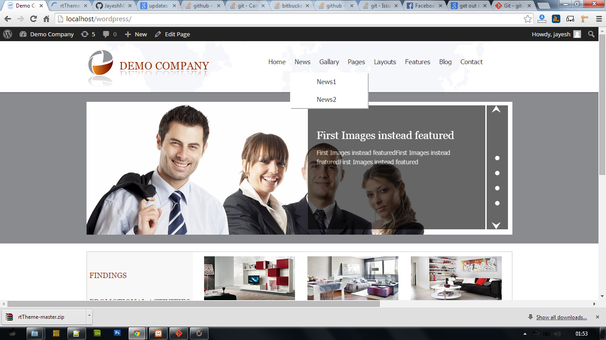

rtTheme
=======
**Contributor:** [wp-jayesh](http://profiles.wordpress.org/wp-jayesh).

**Requires at least:** 4.1  
**Tested up to:** 4.1  
**Stable tag:** 1.0 
**License:** [GPLv2 or later](http://www.gnu.org/licenses/gpl-2.0.html).
## Description ##
rtCamp Wordpress Assignment
* Problem Statement: WordPress Theme with slider,post contents and different widgets.
* Standards: Followed Wordpress Coding Standards,PHP Coding Standards
* Testing Done With: PHPUnit 4.0 By Sebastian. 
* Easy  setup and Integrate.
* Easy Theme Options Page.

Following are some of the trivial features that Assignment Theme(rtTheme) offers:

* Upload Header Logo via theme options.
* Upload Footer Logo via theme options.
* Update the Footer Copyright Statement via theme options.
* Update your social media profiles via Social Media Widgets.
* Fully Functional Slider.
* Show recent Posts with different categaories.

**Important Links Used as Library**
* [Bootstrap](http://getbootstrap.com/)-Responsive Design CSS FrameWork
* [Option Tree](https://wordpress.org/plugins/option-tree/)-Wordpress Theme Option Setter Plugin
* [CYCLE JAVASCRIPT](http://jquery.malsup.com/cycle/)-Vertical Slider Frame Work
* [wp-recent-post-bu-category](https://wordpress.org/plugins/wp-recent-posts-from-category/)-Show recent post by category
* [Black Studio TinyMCE Widget](https://wordpress.org/plugins/black-studio-tinymce-widget/)-Advanced Text Widgets 

## Installation ##

* Install the theme from the 'Themes' section in your dashboard (Go to `Themes > Add New > Upload`) upload zip file.
* Activate it through the 'Themes' section.

## Screenshots ##

### Main Home Page

### Wordpress 2 level Menu

### Show child Pages when hover on Parent Pages

### Footer Widgets(Recent News,Social Media etc)

### Theme Optiond to UPLOAD custom logo,social media links

